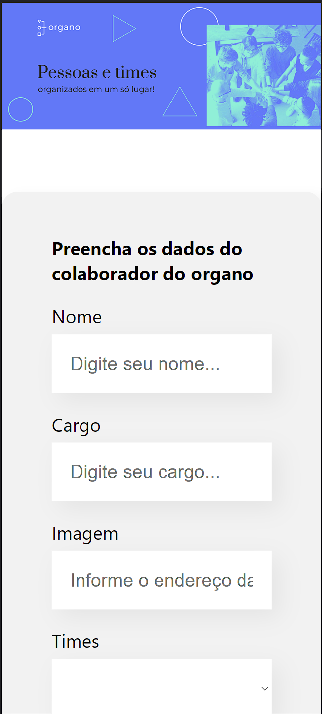
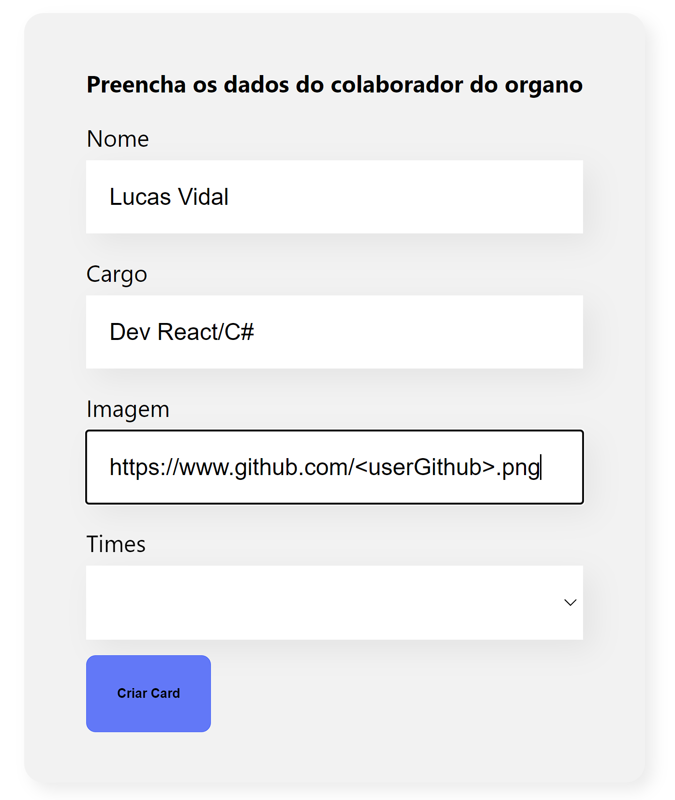
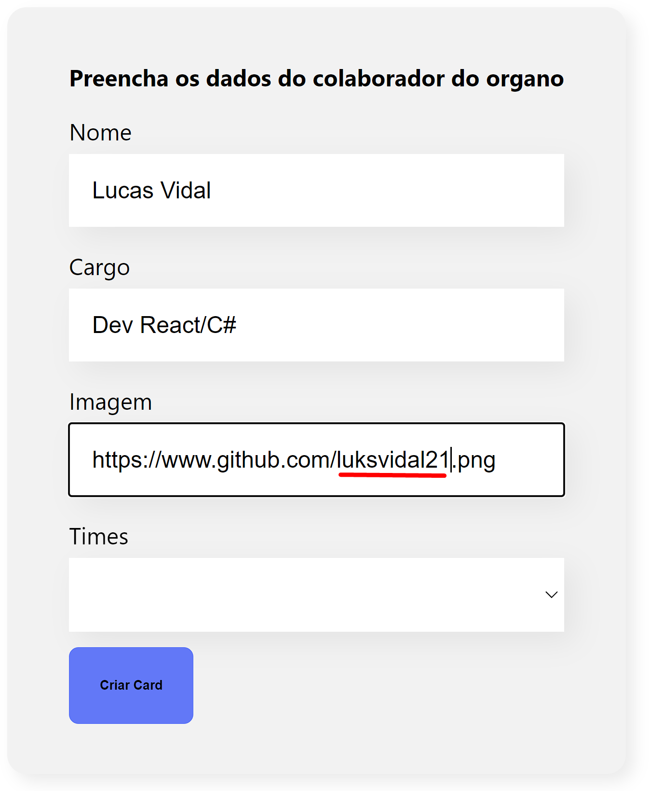
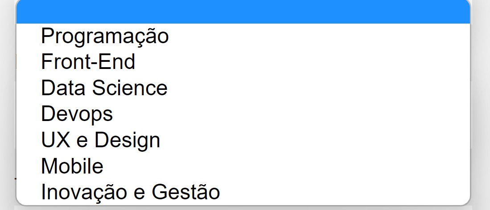

# Organo

O Organo é um ambiente para montar e organizar seus times ou equipes de tecnologia.
## Imagens e Links

Link para o projeto:
https://organo-lake-delta.vercel.app/
    
### Tela Inicial


###  Dica para adicionar imagem do perfil do Github no endereço de imagem


### Dados Preenchidos


### Opções de Times de Tecnologia


### Resultado Final


## Stack utilizada

**Front-end:** React/Js


## Rodando localmente

Clone o projeto

```bash
  git clone https://github.com/luksvidal21/organo
```

Entre no diretório do projeto

```bash
  cd organo
```

Instale as dependências

```bash
  npm install
```

Inicie o servidor

```bash
  npm run dev
```


## Aprendizados

Esse projeto serviu para relembrar e também fomentar novos aprendizados em React, aumentando ainda mais meu conhecimento nessa tecnologia e nos conceitos inicial dessa biblioteca Javascript.

